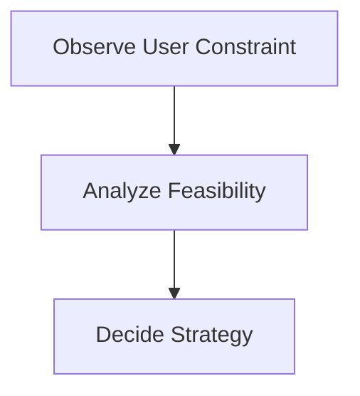
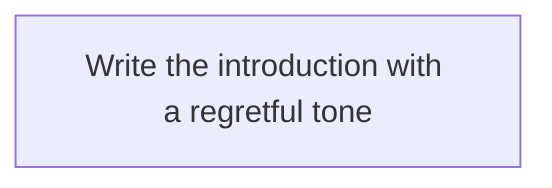
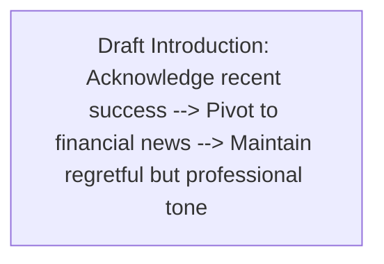
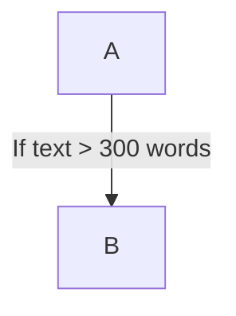

# BRAID Prompting

Create BRAID prompts according to the paper "BRAID: Bounded Reasoning for Autonomous Inference and Decisions".

Do not add recommendations that are not supported by the paper. Ground all guidance in the paper's stated BRAID methodology, experimental protocol, appendix prompt, and graph construction principles.

## Definition

BRAID is a structured prompting framework that replaces natural-language Chain-of-Thought traces with bounded, symbolic reasoning structures expressed in Mermaid diagrams.

The paper describes BRAID as changing the model's reasoning process from an unbounded linguistic monologue to a bounded, symbolic plan. Its core principle is to compress the cognitive process into high-density tokens by encoding logical flow as a diagram instead of descriptive text.

## Core Mechanism

Use Mermaid diagrams to express deterministic logical flows.

The paper's mechanism is:

1. Replace natural-language reasoning traces with structured symbolic reasoning paths.
2. Encode the logical reasoning process as a Mermaid diagram.
3. Use the BRAID diagram as a system message for the solver model.
4. Let the solver produce the final answer.

## Two-Stage Protocol

Follow the paper's two-stage protocol:

1. **Prompt Generation**: Generate a BRAID Mermaid diagram encoding the logical reasoning process for the question or conversation.
2. **Prompt Solving**: Use another model, either the same tier or a different tier, with the BRAID as a system message to produce the final answer.

## BRAID Generation Prompt

Use the appendix prompt from the paper when generating the symbolic reasoning graph. Replace `${conversationText}` with the conversation history.

```text
You are an expert at generating clear, structured Mermaid flowcharts to plan responses in multi-turn conversations.

Task:
- Read the entire conversation history.
- Extract constraints, user-provided facts, references (including version references), and goals.
- Produce a flowchart plan that guides producing the best final assistant reply to the last user turn.
- Do NOT include the response itself--only the plan.
- Start exactly with 'flowchart TD'

Conversation:
${conversationText}

Output Requirements:
1. Output ONLY Mermaid code, no extra text/markdown.
2. Start exactly with 'flowchart TD'
3. Each node should represent constraints, facts, or steps to produce the final reply.
4. End nodes should indicate checks against constraints or rubric-related requirements (if implied).
```

## Graph Construction Principles

Use the four graph construction principles from Appendix A.4.

### 1. Node Atomicity And Token Density

Each node must represent an atomic reasoning step.

Decouple observation, analysis, and conclusion into distinct nodes.

Use the paper's example structure:



The paper states that nodes containing fewer than 15 tokens yield the highest adherence rates in Nano-tier models. Avoid verbose nodes because they reintroduce the noise of unstructured prompting.

### 2. Procedural Scaffolding Vs. Answer Leakage

Distinguish planning the output from generating the output.

Avoid leaking the response text into the graph.

Ineffective leaking example from the paper:



Effective scaffolding example from the paper:



For creative or open-ended tasks, encode the constraints and semantic requirements of the response, not the response text itself.

### 3. Deterministic Branching Logic

Use deterministic and mutually exclusive edges.

The paper states that low-parameter models often struggle with ambiguity. Use labeled edges as explicit condition checks.

Example from the paper:



### 4. Terminal Verification Loops

Encode a Critic phase before the final output.

Converge on verification nodes before reaching the final `End` node.

Use checks like the paper's examples: `Check: Tone is empathetic` and `Check: No prohibited keywords`.

If a check fails, include a feedback edge routing logic back to a revision node.

## Numerical Masking Protocol

Use numerical masking for math-style graphs when answer leakage is possible.

The paper applies this protocol to GSM-Hard because generating a logic graph for math can cause the generator model to transcribe intermediate values into node labels.

To prevent the solver from retrieving pre-calculated solutions, parse the Mermaid diagram and replace all numerical literals with `_`.

This makes the artifact convey only logical topology while withholding computational state.

## Production And Caching

The paper states that automated LLM-generated reasoning graphs were used in evaluation as a scalable alternative to manually optimizing graphs for each unique question.

For production, the paper states that BRAID is designed to leverage predefined, manually handcrafted reasoning plans that can be cached and reused repeatedly.

For autonomous agents that run continuously, the paper advocates a split-architecture approach:

1. Use a high-intelligence model only once to generate the BRAID graph.
2. Cache the graph.
3. Use a low-cost, high-speed model to execute the graph repeatedly.

## Output When Asked To Create A BRAID Prompt

When generating the symbolic reasoning graph, output only Mermaid code with no extra text or markdown.

Start exactly with:

```text
flowchart TD
```

Ensure that:

- Each node represents constraints, facts, or steps to produce the final reply.
- End nodes indicate checks against constraints or rubric-related requirements when implied.
- Nodes are atomic.
- Nodes stay below 15 tokens where possible.
- The graph scaffolds the procedure and does not include the final response.
- Branching edges are deterministic and labeled when conditions are present.
- Verification nodes appear before the final endpoint.
- Failed checks route back to a revision node when applicable.

## Example From The Paper

The paper provides this generated BRAID graph example for a multi-turn instruction-following task:

```mermaid
flowchart TD
A[Read last user request and full conversation context] --> B[Identify applicable system constraints]
B --> C1[Constraint: Provide at least 3 distinctly different solutions with headers; under each header add one sentence explaining how it solves the problem and how it differs]
B --> C2[Constraint: If response would exceed 250 words, cap at 250 words]
B --> C3[Constraint: End by asking if they want a full-length response for one suggestion; if they later answer no, ask if they need anything else]
B --> C4[Constraint: If user provides plagiarized text, do not help with it; steer them toward creating something similar]
B --> C5[Constraint: Do not continue or closely paraphrase copyrighted lyrics; keep original content only]
B --> C6[Constraint: Keep formatting simple; use headers for solutions]
A --> F1[Fact: User pasted lyrics from a well-known song chorus (Blank Space by Taylor Swift)]
A --> F2[Fact: User wants help writing verses for that chorus]
F1 --> D[Determine approach based on plagiarism rule]
F2 --> D
C4 --> D
D --> S1[Step: Politely state you can't continue those exact lyrics and steer toward creating a similar, fully original song/verses instead]
S1 --> S2[Step: Solution 1 Header + one-sentence explainer: Create original verses using a fresh metaphor palette and new hook to capture high-drama romance without echoing the source]
S1 --> S3[Step: Solution 2 Header + one-sentence explainer: Write verses from a distinct narrative POV/structure, such as call-and-response or unreliable narrator, to differentiate tone and story arc]
S1 --> S4[Step: Solution 3 Header + one-sentence explainer: Shift genre/tempo imagery, such as noir city, desert road, or midnight carnival, to generate unique rhythms and rhyme schemes]
S4 --> S5[Step: Invite user to pick a direction and share vibe/tempo/rhyme preferences so you can draft original verses and an original chorus if desired]
S5 --> S6[Step: Close by asking if they want a full-length response for one suggestion]
S2 --> WC[Check: Keep total response <= 250 words]
S3 --> WC
S4 --> WC
S6 --> D1[Check: No continuation or close paraphrase of copyrighted lyrics]
S6 --> D2[Check: At least 3 distinct solutions present with headers + one-sentence explanations]
S6 --> D3[Check: Explicit steering away from plagiarizing included]
S6 --> D4[Check: Closing question asks about full-length response per instructions]
S6 --> D5[Check: Tone remains supportive and encouraging]
```
