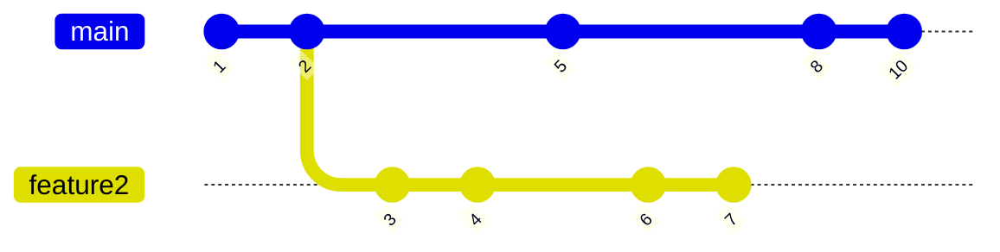
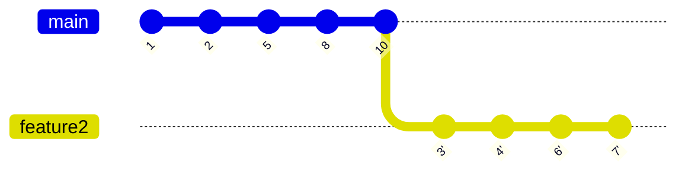
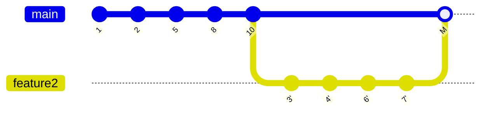

# Git Branch Workflow

## Core Philosophy

> History is best experienced when it's linear.

Git history should be readable and traversable. A tangle of merge commits from parallel branches makes it impossible to understand what changed when and why.

## Branch Structure

| Branch | Purpose |
|--------|---------|
| `master` | Always ready to deploy |
| `test` / `staging` / `production` | Environment tracking branches (or use tags) |
| Feature branches | One branch per feature, named descriptively |
| Bug fix branches | One branch per issue, named after the issue ID |

**Rule:** Never produce merge commits inside a feature branch. If two developers share a feature branch, the latecomer must `git pull --rebase`.

Set rebase as the default pull strategy globally:

```bash
git config --global pull.rebase true
```

---

## The Feature Branch Workflow

### 1. Branch off master

```bash
git checkout -b feature/my-feature
```

### 2. Develop, committing as you go

Keep commits small and focused. Rebase onto master frequently to stay current and resolve conflicts early while they're small:

```bash
git pull --rebase origin master
```

> Constantly rebasing squashes conflicts when they're tiny, avoiding the chaotic "conflict resolution evening" at the end.

### 3. Before opening a PR: rebase onto master

```bash
git checkout feature/my-feature
git pull --rebase origin master
```

This replays your commits on top of master's latest commit, as if you branched off today. Resolve any conflicts commit-by-commit—each conflict is isolated to the actual commit that introduced it, giving you full context.

### 4. Force push the rebased branch

After rebasing, the remote branch history has diverged. Force push is required and expected for feature branches:

```bash
git push --force-with-lease origin feature/my-feature
```

> Force push is fine—even normal—for feature branches. Never force push to `master`, `test`, or `production` except in emergencies.

### 5. Merge with `--no-ff`

When merging a pull request by hand (or reviewing the result), use `--no-ff` to preserve the branch context:

```bash
git merge --no-ff origin/feature/my-feature
```

This creates a single merge commit that marks where the feature was integrated, keeping the feature commits grouped together and attributable.

If merging via GitHub/GitLab, verify the branch is rebased onto master before clicking the merge button (check the Network graph). If the automatic merge button is greyed out, tell the developer to rebase first.

---

## Why Rebase Instead of Merge for Integration

| Merge (without rebase) | Rebase then `--no-ff` merge |
|------------------------|------------------------------|
| Merge conflicts resolved in a single catch-all commit with no context | Conflicts resolved per-commit, in context |
| History is a tangled graph | History is linear and readable |
| Feature conflicts are the maintainer's problem | Feature conflicts are the developer's responsibility |
| Relative ordering of unrelated commits clutters history | Feature branch appears as a clean unit on master's timeline |

---

## Visual Summary

**Before rebase** — tangled parallel history:



**After rebase onto master** — feature branch starts at the tip of master:



**After `--no-ff` merge** — clean, linear, feature is a distinct unit:



Clean, readable, and each feature is a distinct unit in history.
